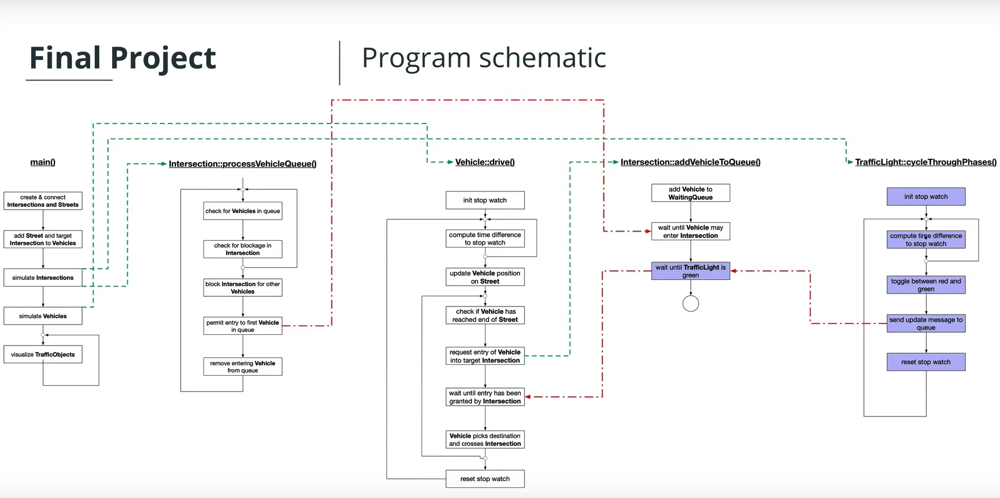

# Concurrent Traffic Simulation

A multithreaded traffic simulator using a real urban map. Runs each vehicle on a separate thread, and manages intersections to facilitate traffic flow and avoid collisions.

Refer to the following:


## Dependencies for Running Locally
* cmake >= 2.8
  * All OSes: [click here for installation instructions](https://cmake.org/install/)
* make >= 4.1 (Linux, Mac), 3.81 (Windows)
  * Linux: make is installed by default on most Linux distros
  * Mac: [install Xcode command line tools to get make](https://developer.apple.com/xcode/features/)
  * Windows: [Click here for installation instructions](http://gnuwin32.sourceforge.net/packages/make.htm)
* OpenCV >= 4.1
  * Linux: `sudo apt install libopencv-dev`
  * The OpenCV 4.1.0 source code can be found [here](https://github.com/opencv/opencv/tree/4.1.0)
* gcc/g++ >= 5.4
  * Linux: gcc / g++ is installed by default on most Linux distros
  * Mac: same deal as make - [install Xcode command line tools](https://developer.apple.com/xcode/features/)
  * Windows: recommend using [MinGW](http://www.mingw.org/)

## Project Program Schematic

The structure and logic of the program is explained in the following image




## Project Structure

```
.
├── CMakeLists.txt                    # CMake build configuration
├── data/                             # Map images (Paris/NYC) and result GIFs used by the README
└── src/
    ├── TrafficSimulator-Final.cpp    # Entry point: builds the Paris/NYC scenes and starts the simulation
    ├── TrafficObject.{h,cpp}         # Base class for every object on the map (unique IDs, position)
    ├── Intersection.{h,cpp}          # Intersection logic + thread-safe WaitingVehicles queue
    ├── Street.{h,cpp}                # A street connecting two intersections
    ├── Vehicle.{h,cpp}               # A vehicle that drives between intersections on its own thread
    ├── TrafficLight.{h,cpp}          # Traffic light + templated thread-safe MessageQueue for phase changes
    └── Graphics.{h,cpp}              # Loads the map image and renders the simulation with OpenCV
```


## Basic Build Instructions

1. Clone the project repository: `git clone https://github.com/vrushabhdesai/Concurrent_Traffic_Simulation.git`
2. Make a build directory in the top level directory: `mkdir build && cd build`
3. Compile: `cmake .. && make`
4. Run it: `./traffic_simulation`.
